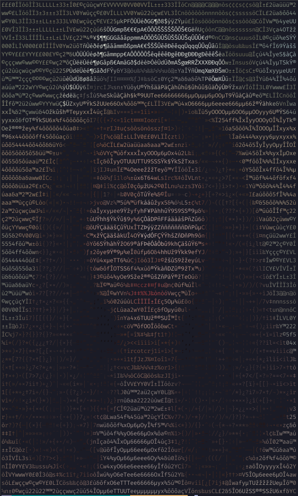

# Ascii Image Converter

Easily and convert your images to ASCII with a CLI according to some options.

## Dependencies:
-   **python** (```>=3.9```)
- Python packages: ```pip install -r requirements.txt```

## Printing Examples

### Default settings
The program can convert images to ASCII and print them to the terminal.

```bash
python3 ascii_image.py print-image girl.jpg
```


### Extended palette
```bash
python3 ascii_image.py print-image girl.jpg --palette-code extended
```


### Black & White color
```bash
python3 ascii_image.py print-image girl.jpg --color 'b&w'
```


### Uncolored + reduced palette
```bash
python3 ascii_image.py print-image girl.jpg --color none --palette-code reduced
```


### Uncolored + reduced palette + Tiny terminal fontsize
The conversion dimensions will adapt to the terminal width and height. Thus, you change the terminal's dimensions to get a conversion with greater/less detail.

```bash
python3 ascii_image.py print-image girl.jpg --color none --palette-code reduced
```


### Modified palette
```bash
python3 ascii_image.py print-image girl.jpg --palette ". "
```


## Converting Examples
The program can convert images and save the conversion in a separate file

```bash
python3 ascii_image.py convert-image girl.jpg output.txt
```

Contents of output.txt:
```
+++++++++++++++++++++++++++++++++++++++++=====++++**++
+++++++++++++++++++++++++****+++++===+++======++++****
++++++++++++++++++**##%%%%@@@@%%%##*++=+++====++++****
++++++++++++++**#%%%@@@@@@@@@@@@@@@@@%*+++====++++**##
+++++++++++++*#%%%%%@@@@@@@@@@@@@@@@@@@%*+===++****###
+++++++++++*#%%%%%%%%%###*****###%%@@@@@%+++=++*****##
+*+++++++++#%%%%#*++=======++++++***#%%@@*++=+++******
***+++++++*%%#*+=+++****###########****####****+++++++
***++++++**%#*********+++++====+++************###**+++
***************+==-----====---::::::--=+**************
************+=-::--===+++++++==--:::::::-=+***********
**********+-:::::-=++++******++++=::::::::-+**********
*******+++-:::::-=+**********###**+=:::--::-+*********
******+++-:::::::====++*******++++++--:---::=*********
*****+++=::::::::======++***++=====+=------:-+********
***++++=-:::::::---=-=+++*##**+=-==---------:-+*******
+*+++++=::::::::+*****#**#######*##*+-:::----:=+****++
*++++++-:-:::::-*######**#%%########*-:::----:-=++++++
***+++=---:::::=**####***#%%########+-:::::----=++++++
*****+=---:::::-+**##***+****##*###*+-:::::-:--=++++++
*****+=---:::::-=+******+++++*###***=::::::-:--=++++++
*****+----::::::-++*********###****+-:::::::-:--=+++++
++**+=----:-:::::-=+++========+++*+-:::::::::-:-=+++++
+++++-----:-:::::.:=++*+++++++***+-:::::::::::::-=++==
++++=-----:-:::::...:=+********+=:..::::::::::---=++++
++=------::--:::::...:-=++++++=-:...:::::::::::---=+**
=---------:--:::::...:----------:..:::::-:::::-----=+*
---------::--:.:::.:::-=======--:..:::::-:::::------=+
---------:::--::::::--=========-:::::::::::----------=
--:------:::--::::::-=++++++++==-::::::::::----------=
--:------:::---:-:::-=+**++++++=-::::::::::------:::--
-:::----::::---::---=++**+++++=--::--:::::-----:::::-+
=--::--::::--:--:=++*********+==-----:::-:---::::::-+*
==-::::::::-::::-+************+=--:::::--::-::::==++**
+++=-::::-::::::-=+***********++=-:::::--::::::-++***+
+++++=-===-::::::-=************++=-:::::::::-++******+
++++++++++==----=++*************+=-:::::---=+********+
=+++++++++++++++*****************++=====++****###****+
```

## Documentation with --help

Example with print-image
```bash
python3 ascii_image.py print-image --help
```
```
Usage: ascii_image.py print-image [OPTIONS] PATH

  Print the ASCII conversion of an image into the terminal.

Arguments:
  PATH  [required]

Options:
  --color [full|b&w|none]         The color compatibility you want to give the
                                  terminal output.  [default: full]
  --palette-code [extended|standard|reduced|block]
                                  The palette code for one of the preset
                                  palettes available.  [default: standard]
  --palette TEXT                  The palette of characters that is going to
                                  be used to convert each pixel into a
                                  character. The palette should be given in
                                  decreasing order of intensity ex: '#-. '
                                  instead of ' .-#' .
  --random-char / --no-random-char
                                  Assign a random character from the palette
                                  to each pixel.  [default: no-random-char]
  --fontratio FLOAT               The proportion between the width of the font
                                  to the height of the font (x/y).  [default:
                                  0.5]
  --help                          Show this message and exit.
```

# Developer's note
This project was written with clean code in mind.

I explicitly decided to use typing and functional programming.

I missed OOP for this project, but I just wanted to test the alternative.

Have a good day,
monscodex
